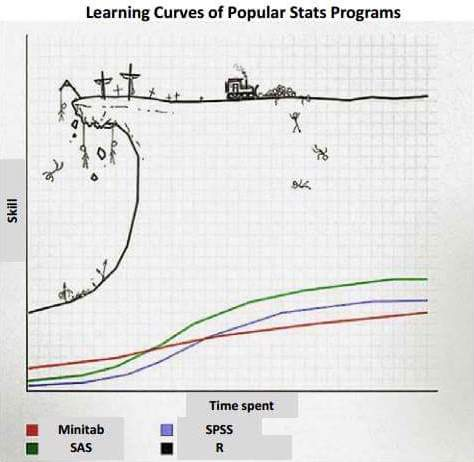
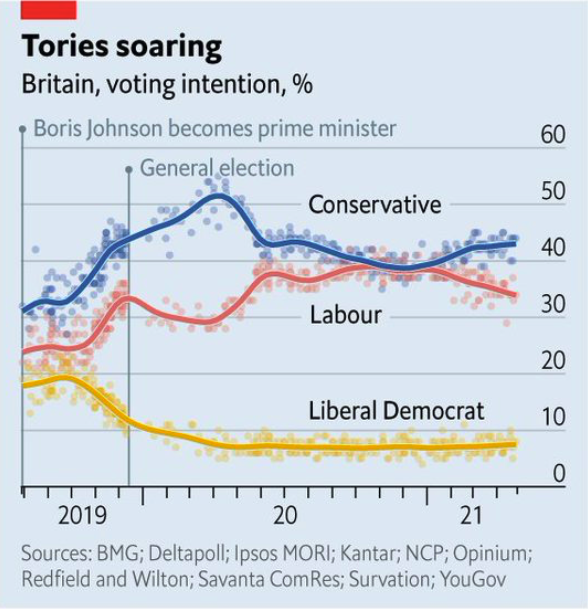
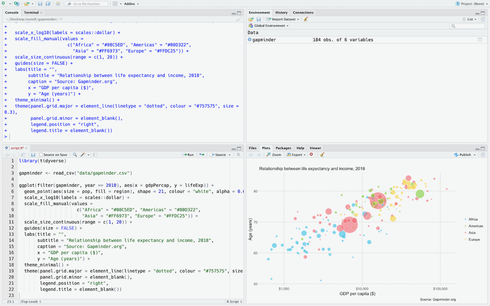
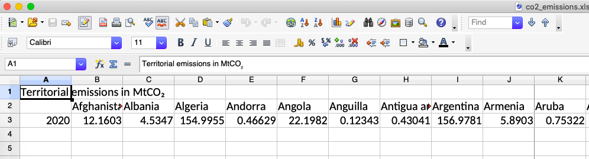

---
output:
  xaringan::moon_reader:
    css: ["default", "styles.css"]
    lib_dir: libs
    seal: false
    nature:
      highlightStyle: github
      highlightLines: true
      countIncrementalSlides: false
      slideNumberFormat: "%current%"
      ratio: 16:9
---


```{r setup, include=FALSE}
options(htmltools.dir.version = FALSE)
library(tidyverse) ; library(readxl) ; library(flipbookr) ; library(scales) ; library(ggtext)
knitr::opts_chunk$set(message = FALSE, warning = FALSE, comment = "", cache = F)
```

class: title-slide, center, middle

###for data vis
.large[Henry Partridge | Blocks | 18 November 2021]

---
### What is R?

--

R is an open source programming language for statistical analysis and data visualisation. It was developed by Ross Ihaka and Robert Gentleman of the University of Auckland and released in 1995. There are now over 18,000 [packages available for R](https://cran.r-project.org/web/packages) which provide functions for machine learning, genomics, time series forecasting, and interactive graphics amongst many others. 

--

R is widely used in academia and by well known companies like [Google](https://ai.google/research/pubs/pub37483), [Netflix](https://www.youtube.com/watch?v=dLKky1xIxtc) and [Airbnb](https://peerj.com/preprints/3182/) for data analytics. Many graphics published by news outlets like the [Financial Times](https://johnburnmurdoch.github.io/slides/r-ggplot/#/), the [Economist](https://view.e.economist.com/?qs=9db46a5ab8bd7989e9ad83c0c1650b6b53bf423e258162b83d2ab809d5b02a0c745255e59bca0c4d53d68352d64da4c9437ab0ee8ccf8f138b3357580df1c002e0b9ba32c4a47c1318509016cc731ea1) and the [BBC](https://twitter.com/chrisjeavans/status/1011694262935834629) are  generated in R. 

---
### Why use R?

--

- free
- open source
- advanced statistical analysis
- publication ready graphics

--

</br>
Since R is a language it is also:

- open
- shareable
- reproducibile
- human readable
- [diffable](https://en.wiktionary.org/wiki/diffable)

---
### Are there any disadvantages?

--
</br>
<div align="center">

</div>

---
class: inverse, middle, center
# Example visualisations

---
class: middle, center
```{r, echo=FALSE, out.width="70%", fig.align='center', fig.cap='<a href="https://twitter.com/jburnmurdoch/status/1237737352879112194">John Burn-Murdoch, Financial Times</a>'}
knitr::include_graphics("img/ft.jpeg")
```

---
class: middle, center
```{r, echo=FALSE, out.width="60%", fig.align='center', fig.cap='<a href="https://www.bbc.co.uk/news/business-43668187">Clara Guibourg, BBC</a>'}
knitr::include_graphics("img/bbc.png")
```

---
class: middle, center
```{r, echo=FALSE, out.width="50%", fig.align='center', fig.cap='<a href="https://twitter.com/baskerhel/status/1404404987002818562">Helen Atkinson, Economist</a>'}

```

---
class: inverse, middle, center
# RStudio

---
### RStudio

[RStudio](https://www.rstudio.com/products/RStudio/) is an integrated development environment (IDE) for R. It's intuitive interface makes working with R much easier. It supports syntax highlighting, tab completion and is integrated with [R Markdown](https://rmarkdown.rstudio.com/). 

RStudio is freely available under the [GNU Affero General Public License v3](http://www.gnu.org/licenses/agpl-3.0-standalone.html). A commercial desktop license is also available.

---
### The panes      

<div style= "float:right; position: relative; padding-left: 30px; padding-bottom: 30px;">

```{r, out.width = "500px", echo=FALSE}

```

</div>

RStudio has four different panes:

- The **Console** pane (top left) is used to execute R commands immediately.

- The **Environment** pane (top right) shows the datasets, models, and plots that are loaded in the current R session. This pane also contains tabs with a scrollable history of executed code, connections to databases and [Git](https://git-scm.com/) options.

- The **Files** pane (bottom right) shows plots and interactive web content, help documentation, previous commands, and R packages that you can install and load.

- The **Source** pane (bottom left) appears when you open a new file e.g. *File -> New File -> R Script*. Code can be saved in dedicated .R scripts and executed in the console with Ctl-Enter/Cmd-Enter. Syntax highlighting and tab completion are also available.

---
class: inverse, middle, center
# Setup

---
### Organise your project       
Adopting a consistent folder structure for your data analyses will help to ensure that your projects are reproducible. A project can be organised using a simple file structure like this:

```
project/
|
├── data/          # store your datasets
|
├── script.R       # your R script
|
└── output/        # all your plots, models etc
```

---
### Set your working directory   
Point your R session to your project folder using: *Session > Set Working Directory > Choose Directory*

NB It's not good practice to set your working directory at the top of your R script because absolute paths don't promote reproducibility.

*Optional*: Set up a [project in RStudio](https://support.rstudio.com/hc/en-us/articles/200526207-Using-Projects)

---
### Open a new R script       
*File > New File > R Script*

---
### Install R packages    
You only need to install an R package once. Subsequent package updates can be handled by selecting *Packages > Update* in the **Files** pane of RStudio.
```{r, eval=FALSE}
install.packages("tidyverse")
```

---
### Load R packages 
Packages need to be loaded at the start of every R session to give you access to the functions you need.
```{r}
library(tidyverse)
```

---
class: inverse, middle, center
# Import

---
### Importing data

R can handle a range of data formats: .xlsx, .csv, .txt, .sav, .shp etc. Some data formats require specific packages.

We are going to install and load another package called [readxl](https://readxl.tidyverse.org) so that we can import an Excel file.

```{r, eval=FALSE}
install.packages("readxl")
library(readxl)
```

Next we'll download and import some CO<sub>2</sub> emissions data collected by the [Global Carbon Project](http://www.globalcarbonatlas.org/en/CO2-emissions).

```{r, eval=FALSE}
read_xlsx("data/co2_emissions.xlsx")
```

---
```{r, echo=FALSE, message=FALSE}
read_xlsx("data/co2_emissions.xlsx")
```

--
</br>
```{r, echo=FALSE, out.width="80%", fig.align='left'}

```


---
class: inverse, middle, center
# Tidy

---
### Tidying data

Tidy data are structured for use in R and satisfy three rules:

1. Each variable must have its own column
2. Each observation must have its own row
3. Each value must have its own cell

</br>
<figure>

 <figcaption>
 Source: <a href="https://r4ds.had.co.nz/tidy-data.html">R for Data Science</a>
 </figcaption>
</figure>
</br>

---
`r chunk_reveal(chunk_name = "tidy", title = "### Tidying data")`
```{r tidy, include = FALSE}
read_xlsx("data/co2_emissions.xlsx", skip = 1) %>% 
  rename(year = 1) %>% 
  pivot_longer(-year, names_to = "country", values_to = "value") %>% 
  pivot_wider(names_from = country, values_from = value) %>% 
  pivot_longer(-year, names_to = "country", values_to = "value")
```

---
class: inverse, middle, center
# Transform

---
`r chunk_reveal(chunk_name = "transform", title = "### Transforming data")`
```{r transform, include = FALSE}
read_xlsx("data/co2_emissions.xlsx", skip = 1) %>% 
  rename(year = 1) %>% 
  pivot_longer(-year, names_to = "country", values_to = "value") %>% 
  mutate(percent = value / sum(value, na.rm = TRUE)) %>%
  arrange(desc(value)) %>% 
  slice(1:10)
```

---
class: inverse, middle, center
# Visualise

---
`r chunk_reveal(chunk_name = "visualise", title = "### Visualising data")`
```{r visualise, include = FALSE}
read_xlsx("data/co2_emissions.xlsx", skip = 1) %>% 
  rename(year = 1) %>% 
  pivot_longer(-year, names_to = "country", values_to = "value") %>% 
  mutate(percent = value / sum(value, na.rm = TRUE)) %>%
  arrange(desc(value)) %>% 
  slice(1:10) %>% 
  ggplot(aes(percent, fct_reorder(country, percent))) +
  geom_col(fill = "#27A0CC", width = 0.9) +
  scale_x_continuous(expand = c(0, 0), labels = percent_format(accuracy = 1)) +
  labs(x = NULL, y = NULL,
       title = "China's emissions are double the US",
       subtitle = paste0("Share of global CO<sub>2</sub> emissions from fossil fuels, 2020</span>"),
       caption = "Source: Global Carbon Project") +
  theme_minimal(base_size = 14) +
  theme(text = element_text(family = "Open Sans"),
        plot.margin = unit(rep(1, 4), "cm"),
        panel.grid.major.y = element_blank(),
        panel.grid.minor = element_blank(),
        plot.title.position = "plot",
        plot.title = element_markdown(face = "bold", size = 22, lineheight = 26),
        plot.subtitle = element_markdown(margin = margin(b = 20)),
        plot.caption = element_text(colour = "grey60", margin = margin(t = 20, b = -10)),
        axis.text = element_text(colour = "#333333"))
```

---
## Further resources

**Beginners**     
- [RStudio primers](https://rstudio.cloud/learn/primers)   
- [R for Data Science](https://r4ds.had.co.nz/) by Hadley Wickham and Garrett Grolemund   

**Data visualisation**    
- [Fundamentals of Data Visualization](https://clauswilke.com/dataviz) by Claus Wilke
- [Data Visualization: A practical introduction](http://socviz.co/) by Kieran Healy   
- [SDS 375: Data Visualization in R](https://wilkelab.org/SDS375/)
- [BBC Visual and Data Journalism cookbook for R graphics](https://bbc.github.io/rcookbook)   

**Statistics**   
- [Discovering Statistics Using R](https://us.sagepub.com/en-us/nam/discovering-statistics-using-r-and-rstudio/book261351) by Andy Field  
- [Statistics: An Introduction Using R](https://www.wiley.com/en-gb/Statistics%3A+An+Introduction+Using+R%2C+2nd+Edition-p-9781118941096) by Michael J. Crawley   

**Style guides**      
- [The tidyverse style guide](http://style.tidyverse.org/)   
